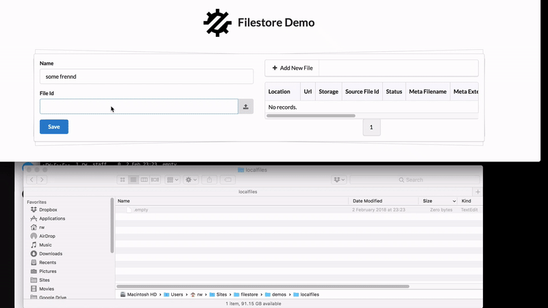
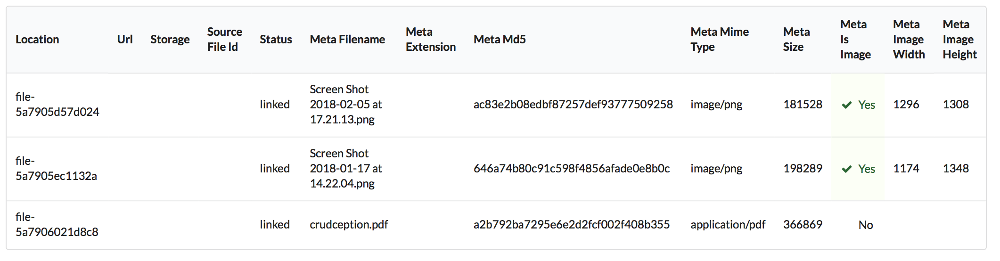
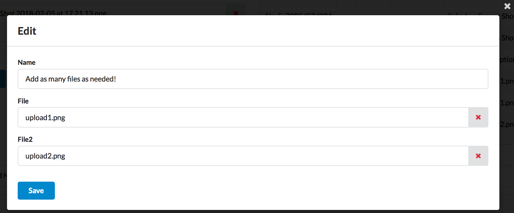
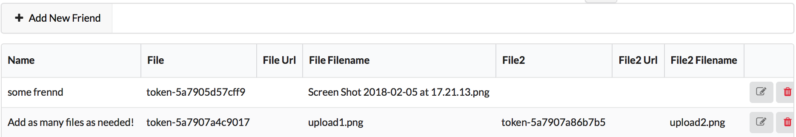

Starting from Version 1.4 of ATK UI, it adds support for File and Image uploads. In it's raw form, developer is
responsible for taking care of the file once it's uploaded. In most cases, developer would want to store file either on
a local or remote filesystem, but he would need to perform that action himself.

**Filestore** is a plugin for ATK Data and ATK UI which offers seamless integration with Flysystem.

## Introduction

Attaching files to your database records is super-simple with **Filestore**. The next example can be implemented and
added to YOUR php application in just a few lines:



Since ATK Form submits using AJAX file must be sent to the server as soon as it is selected. File is instantly placed
inside **flysystem** (in the demo I'm using Local storage) and record in the database is created containing all the
information about the file including if it is an image and if it is - dimensions:



Two random identifiers are generated - one is used for the actual file name (to make sure you don't overwrite existing
file) and another one (token) will be used to reference the file. Actually you don't see a token at all, but it's used
to keep things secure.

Files can be uploaded directly in your CRUD and you can have several file fields:



In your main table you only need one `varchar` field to store file token. If you use SQL, you can have instant access to
additional fields such as public URL (if available), name of original file or more:



This is especially valuable if you need to incorporate all these fields on your custom template.

# Installation and Code

To install run `composer require atk4\filestore` and you will need to create `filestore_file` table. In the definition
of your model, you simply need to declare a new field:

``` php
$this->addField('file', new \Atk4\Filestore\Field\File($this->app->filesystem)); 
```

This pretty much takes care of everything! For full example see file `demos/basic.php`.

# Features

Currently the following features are implemented:

- Nice file upload UI and full integration with ATK UI Form. Upload tracking with a progress-bar.
- Keep files clean, removing record also removes linked files. Files uploaded but not linked remain in status "draft"
  you can clean them up periodically
- Supports any storage through integration with flysystem.
- Very flexible, use different table, map fields differently, use multiple locations, add custom actions and much more.
- Files can be scoped under "user_id" for further security (user won't be able to access images of another user even if
  he knows a token).

# Roadmap

We have the following ideas for the up-coming version. If you would like to help us implement (or sponsor) any of the
features below, please contact @romaninsh (https://gitter.im/atk4/atk4):

- Ability to specify which extensions and/or file types to accept.
- Easy to download file, that was previously uploaded.
- Add automatic thumbnail creation. Delete thumbnails together with original image.
- Specify custom actions for Upload, Link, Unlink and Delete.
- Display icon for file type or preview for image
- Add interactive cropping.
- Add method to verify file.
- Add drag&drop uploading.
- Add new View for a big drop-target or use arbitrary view (upload without form).
- Add a UI for "file management"
- Add support for re-croping thumbnails from originals.
- Integrate NoSQL persistence support.
- Encrypt file before storing / decrypt when loading.
- Add option for "hashing" file into subdirectories.

---------------

OLD README:

event, so file upload will take place as soon as the file is selected. There are however some conditions, when file
uploaded/deleted and form is not submitted.

On successful completion, PHP-side callback is executed to generate **ID**. **Filestore** provides this callback and
performs the following actions:

- Collect information about the file - original filename, size, mime type etc.
- Store information inside "File" model generating ID.
- Move file into Flysystem by using a randomized name, recording it also in "File" model.
- Respond with File's ID which is then passed back into form' submission handler.

## Example

If you have a Model such as `Friend` and you wish to upload friend's photo, Filestore offers a great way to integrate:

```php
// in Friend::init();
$this->addField('file_id', new \Atk4\Filestore\Field\File());
```

This field will automatically appear on the form as an upload field, but in the database will be storing "id" from the "
File" model. You can even define multiple fields like that.

By default the local file storage will be used, but you can configure a different location simply by passing into your
field:

``` php
$this->addField('file_id', [
  new \Atk4\Filestore\Field\File(),
  // specify if you want to only accept certain types of files or extensions.
  'onlyTypes' => ['image/*', 'application/x-pdf'],
  'onlyExtensions' => ['img', 'png', 'pdf'],  // safer to specify both

  // where to store
  'flysystem' => $flysystem,
  
  // you can also define callback if you wish to do something more with the file
  'onUpload' => function($file_info){ /** do something with file */ },
  
  // this is called when form with the file is submitted
  'onAttach' => function($file){ /** $file is a model object **/ },
  
  // when user detaches file from the related entity
  'onDetach' => function($file){ /** $file is a model object **/ }
  
  // If you define this, this field will be created in your model and will contain url
  'urlField' => 'file_url',
  
])
```

If you open form for the `Friend` which already have a file attached, you will be able to remove the files. However
just "removing" files may not mean they will be unassociated, user can still click "Cancel". When form is saved,
however, if the file was removed, it will be also deleted from the storage and from `File` table.

## Image

Filestore also implements `\Atk4\Filestore\Field\Image` class which offers additional features by extending File to
automatically crop and store various thumbnails for an image.

``` php
$this->addField('picture_id', [
  new \Atk4\Filestore\Field\Image(),

  // no need to specify types, will only accept valid images
  
  // where to store
  'flysystem' => $flysystem,
    
  // you can still define this if you wish to pre-process your file, e.g. add watermark
  'onUpload' => function($file_info){ /** do something with file */ },
  
  // This will store full-sized image URL. You can disable if you set to: false
  'urlField' => 'picture_url',
  
  // Cropping table
  'crop' => [
    'medium'=> [ 200, 300 ],  // width, height
    'small' => [ 50, 50 ], 
  ]  
])
```

The cropping will maintain aspect ratio of original image, but will make sure that the image is filled. Will use
either "imagick" or "gd" for the operation. Arguments are defined like that:

- `0 => 200`, width
- `1 => height`, height
- `'type'=>'jpeg'`  optional. Defaults to 'png'
- `'urlField'=>'custom_url_field'`, optional. Defaults to `picture_medium_url` combined from original field name, key of
  cropping table item and "_url".

In order to store thumbnails, filestore will create additional file(s) inside `File` table.

## File model

Filestore comes with a custom Model `Atk4\Filestore\Model\File`, which is designed to store file meta-information. For
each uploaded file it stores:

- file_token - generated randomly, used on a form to pass back to submission handler
- location - (used to identify file in Flysystem. Generated randomly)
- url - (if file is stored with a public URL accessible, stores it here)
- storage - (short info on the storage used)
- source_file_id (specify ID of the original file. Used for thumbnails or other generated files)
- status (defines where is file currently)

Several "meta" fields are also defined which describe contents of the file

- meta_filename
- meta_extension
- meta_md5
- meta_mime_type
- meta_size
- meta_is_image
- meta_image_width
- meta_image_height

### Methods

``` php
$file->import('path/to/file.txt');
```

Manually import file. This will also upload file to `flysystem` and save. Technically Upload field simply calls this,
while also setting

``` php
$file->verify();
```

Compare MD5 of `url` with the recorded one, returns true if file is un-changed.

``` php
$path = $file->getFile();
```

Fetches the file into local system and will return path.

## Roadmap

Some of the possible future features:

- Add "temporary" location for files
- Allow option to initialize Flysystem details when loading random file through model


